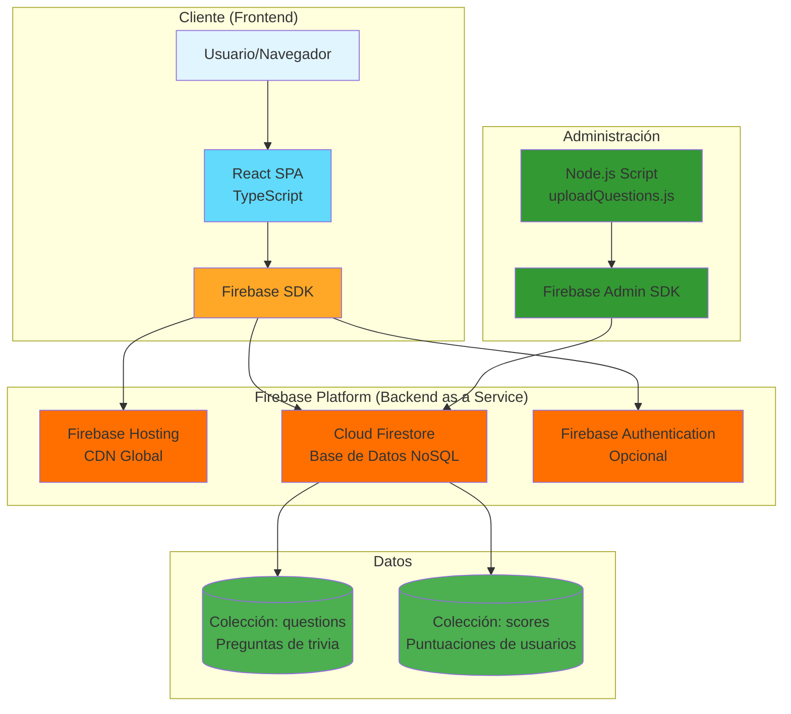

# Diagrama de Arquitectura de Producción - Trivia de Animales

## Arquitectura General



## Stack Tecnológico

### Frontend
- **Framework**: React 19.1.0
- **Lenguaje**: TypeScript 4.9.5
- **UI Framework**: React Bootstrap 2.10.10
- **Animaciones**: React Lottie 1.2.10
- **Build Tool**: Create React App (react-scripts 5.0.1)
- **Hosting**: Firebase Hosting (CDN global)

### Backend
- **Plataforma**: Firebase (Backend as a Service - BaaS)
- **Base de Datos**: Cloud Firestore (NoSQL)
- **Hosting**: Firebase Hosting
- **SDK**: Firebase JavaScript SDK 11.10.0

### Herramientas de Desarrollo
- **Scripts de Administración**: Node.js con Firebase Admin SDK 13.4.0
- **Deployment**: Firebase CLI

## Flujo de Datos

### 1. Carga de Preguntas
```
Usuario → React App → Firebase SDK → Firestore → Colección 'questions'
```

### 2. Guardado de Puntuaciones
```
Usuario → React App → Firebase SDK → Firestore → Colección 'scores'
```

### 3. Administración de Preguntas
```
Admin → uploadQuestions.js → Firebase Admin SDK → Firestore → Colección 'questions'
```

## Estructura de Datos en Firestore

### Colección: `questions`
```json
{
  "question": "¿Cuál es el animal terrestre más grande?",
  "options": ["Elefante africano", "Jirafa", "Rinoceronte", "Hipopótamo"],
  "correctAnswer": "Elefante africano",
  "category": "animales"
}
```

### Colección: `scores`
```json
{
  "nickname": "Usuario123",
  "score": 8,
  "timestamp": "2024-01-15T10:30:00Z"
}
```

## Despliegue en Producción

### Frontend
1. **Build**: `npm run build` - Genera archivos estáticos optimizados
2. **Deploy**: `firebase deploy --only hosting` - Sube a Firebase Hosting
3. **CDN**: Firebase Hosting distribuye automáticamente a CDN global

### Backend
- **Firestore**: Configurado automáticamente en la consola de Firebase
- **Reglas de Seguridad**: Configuradas en Firestore Security Rules
- **Escalabilidad**: Automática con Firebase

## Ventajas de esta Arquitectura

✅ **Sin servidor propio**: Firebase maneja toda la infraestructura  
✅ **Escalabilidad automática**: Firebase escala según la demanda  
✅ **CDN global**: Contenido estático servido desde múltiples ubicaciones  
✅ **Tiempo real**: Firestore permite actualizaciones en tiempo real  
✅ **Seguridad**: Reglas de seguridad integradas en Firestore  
✅ **Costo**: Modelo de pago por uso, ideal para proyectos pequeños/medianos  

## Consideraciones de Producción

### Seguridad
- Configurar Firestore Security Rules para proteger datos
- Validar datos en el cliente y servidor
- Implementar rate limiting si es necesario

### Performance
- Usar lazy loading para componentes pesados
- Implementar caching de preguntas en el cliente
- Optimizar imágenes y assets

### Monitoreo
- Firebase Analytics para métricas de uso
- Firebase Performance Monitoring
- Logs de errores con Firebase Crashlytics


